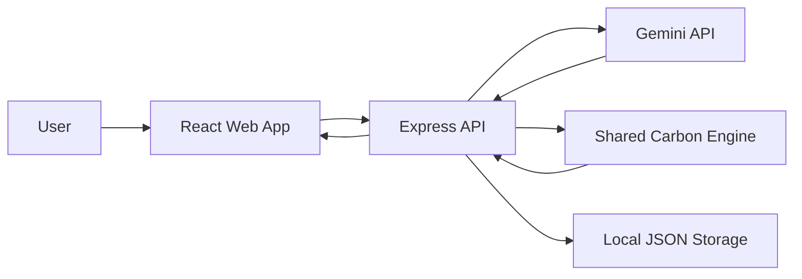
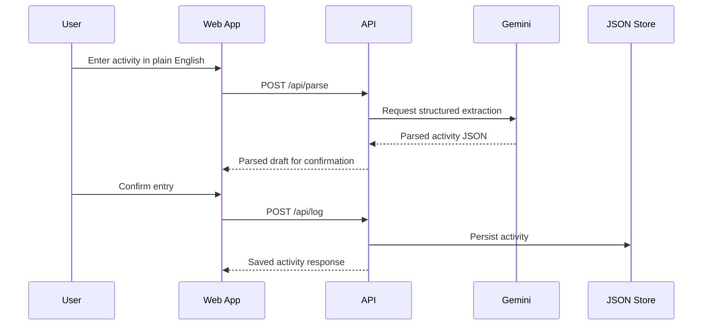
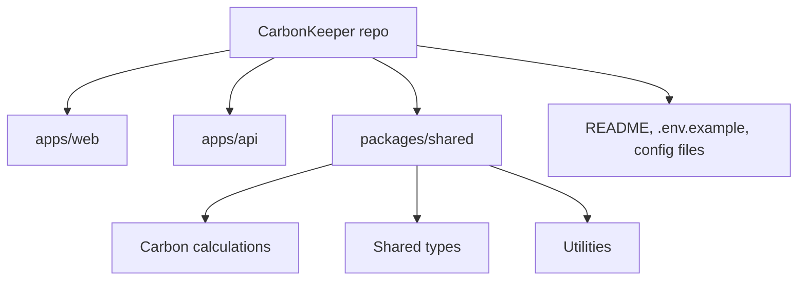

# CarbonKeeper

AI-powered personal carbon coach that turns plain-English activity logging into practical emissions insights.

## Overview

CarbonKeeper is a full-stack TypeScript application for tracking personal carbon footprint without tedious forms. Instead of forcing users to manually choose categories, units, and emission factors, CarbonKeeper lets them describe what they did in natural language and then converts that input into structured carbon data, visual trends, recommendations, and gamified sustainability goals.

## Problem Statement

Most carbon footprint trackers are hard to keep using because they rely on repetitive data entry, confusing category trees, and vague feedback. That creates friction right at the moment people are trying to build a habit. CarbonKeeper solves that by making logging feel conversational, fast, and understandable.

## Why Existing Carbon Trackers Fall Short

- They usually require long forms or rigid category selection.
- They rarely explain why a recommendation matters in personal terms.
- They often surface abstract numbers instead of relatable context.
- They can feel like spreadsheets, not products people want to return to daily.

## Solution Approach

CarbonKeeper combines a conversational logging experience with a domain-driven carbon engine, a secure Gemini-based parsing layer, and a recommendation system that turns user history into specific, actionable guidance. The design is intentionally clean and light so the product feels approachable for non-technical users.

## Features

- Conversational activity logging in plain English
- AI-assisted parsing with Gemini and deterministic fallback logic
- Dashboard with carbon score, weekly trend, category breakdown, and streaks
- Personalized insights and recommendations
- Environmental equivalents for easier comprehension
- Gamified challenges for habit building
- Accessible light-mode UI with responsive layouts
- Local JSON persistence with a migration-ready architecture

## Screenshots

Add the following screenshots before publishing to GitHub:

- `Dashboard` screenshot
- `Activity logging` screenshot
- `Insights` screenshot
- `Challenges` screenshot

## Architecture

### High-Level System Architecture



### Request Flow



### Monorepo Structure



## Frontend Architecture

- `apps/web/src/app`: router and shell layout
- `apps/web/src/features/dashboard`: score, charts, and summary cards
- `apps/web/src/features/activities`: conversational logging and confirmation flow
- `apps/web/src/features/insights`: behavior analysis, recommendations, and equivalents
- `apps/web/src/features/challenges`: streak-oriented challenge UI
- `apps/web/src/shared`: reusable UI, API client, and formatting helpers

## Backend Architecture

- `apps/api/src/app.ts`: Express app wiring
- `apps/api/src/routes`: REST endpoints
- `apps/api/src/services`: activity parsing, Gemini integration, and domain orchestration
- `apps/api/src/middleware`: validation, rate limiting, and error handling
- `apps/api/src/data`: JSON persistence layer

## Folder Structure

```text
CarbonKeeper/
  apps/
    api/
    web/
  packages/
    shared/
  .env.example
  .gitignore
  eslint.config.js
  jest.config.ts
  package.json
  README.md
  tsconfig.base.json
```

## Technology Stack

- Frontend: React, TypeScript, Vite, Tailwind CSS, React Router, TanStack Query, Recharts, Lucide React
- Backend: Node.js, Express, TypeScript
- AI: Google Gemini API
- Testing: Jest, React Testing Library, Supertest
- Tooling: ESLint, Prettier, npm workspaces

## AI Integration Details

CarbonKeeper sends the user’s free-form activity text to the backend. The backend first tries Gemini for structured extraction and then falls back to a deterministic parser if Gemini is unavailable or returns unusable output. This keeps the app resilient while preserving a modern AI-assisted experience.

The Gemini layer is server-side only. No API key is exposed to the browser, and all parsed results are validated before they can be saved.

## Security Considerations

- Secrets live in environment variables only
- API keys are not committed
- Inputs are sanitized and validated with `zod`
- Rate limiting protects the API from abuse
- Error handling is centralized
- The frontend handles malformed responses gracefully

## Accessibility Considerations

- Semantic headings and landmarks
- Keyboard-friendly controls
- High-contrast light theme
- Clear form labels and descriptions
- Responsive layouts for mobile and desktop
- Accessible focus states and readable typography

## Testing Strategy

CarbonKeeper includes automated tests for shared calculations, parsing, recommendations, API routes, utilities, and core UI components. The current test suite contains 106 passing tests across 33 suites, covering the main user flows and key edge cases.

## Performance Optimizations

- Lazy-loaded routes
- React `Suspense` for route boundaries
- Memoized chart components
- Query caching with TanStack Query
- Lightweight local persistence
- Shared domain logic to avoid duplicate computations

## Installation Guide

```bash
npm install
```

## Environment Variables

Copy `.env.example` to `.env` and configure the following values:

- `PORT`: API port, default `4000`
- `CLIENT_ORIGIN`: allowed frontend origin, default `http://localhost:5173`
- `GEMINI_API_KEY`: optional Gemini API key for live parsing
- `RATE_LIMIT_WINDOW_MS`: rate-limit window in milliseconds
- `RATE_LIMIT_MAX`: max requests per window

## Local Development Guide

Run the frontend and backend locally with:

```bash
npm run dev
```

The frontend runs on Vite and proxies `/api` requests to the backend during development.

## Build Instructions

```bash
npm run build
```

## Deployment Instructions

- Frontend: deploy `apps/web` to Vercel
- Backend: deploy `apps/api` to Render
- Set environment variables in the hosting provider dashboards
- Use the backend service URL as the frontend API target in production

## API Documentation

Base path: `/api`

### `POST /api/parse`

Parses a natural-language activity into structured carbon data.

Request body:

```json
{
  "text": "I drove 12 km today",
  "occurredAt": "2026-06-09T10:00:00.000Z"
}
```

### `POST /api/log`

Saves a confirmed activity entry.

### `GET /api/dashboard`

Returns score, streak, weekly trend, and category breakdown data.

### `GET /api/insights`

Returns behavioral analysis, recommendations, and environmental equivalents.

### `GET /api/challenges`

Returns current challenge progress.

## Future Roadmap

- Supabase or PostgreSQL persistence
- User accounts and authentication
- Multi-month analytics
- Goal-setting and reminders
- More granular transport and food models
- Deployment-specific env handling for frontend API URLs

## Contribution Guidelines

- Fork the repository
- Create a feature branch
- Keep commits focused and descriptive
- Run `npm test` and `npm run lint` before opening a pull request
- Include tests for new behavior
- Prefer shared domain logic over duplicated calculations

## License

CarbonKeeper is prepared for public release under the MIT License.

